# 從 0 到百萬用戶
### 學習重點

- **單一伺服器 → 分層架構**：從 All-in-One 開始，流量成長後將 Web 層與資料層拆開，各自獨立擴展
- **請求流程**：DNS 解析網域 → 取得 IP → 發送 HTTP 請求 → 伺服器回傳 HTML / JSON
- **資料庫選型**：SQL（ACID、關聯查詢）適合結構化資料；NoSQL 適合低延遲、非結構化、海量資料
- **擴展策略**：垂直擴展（加硬體）有上限且易單點故障；水平擴展（加機器）是大型系統首選
- **負載平衡器**：以公有 IP 對外、私有 IP 連內部 Web 伺服器，分散流量並提升可用性
- **資料庫複製**：Master 寫、Slave 讀，分散讀取壓力；主庫故障時需提升從庫為新主庫（注意資料同步）
- **快取**：讀取穿透快取減輕 DB 負擔；注意過期策略、一致性、SPOF、驅逐策略（LRU / LFU / FIFO）
- **CDN**：地理分散的快取節點加速靜態資源；注意成本、TTL、故障回源、快取失效
- **無狀態 Web 層**：Session 等狀態外移到共享儲存（Redis / NoSQL），才能自由水平擴展與自動擴充
- **多資料中心**：GeoDNS 就近路由；需處理流量重定向、跨區資料同步、測試與部署一致性
- **訊息佇列**：生產者 / 消費者解耦，非同步處理、緩衝流量，兩者可獨立擴展
- **可觀測性與自動化**：日誌、指標（主機 / 聚合 / 業務）、CI/CD 自動化建置與部署
- **資料庫分片**：水平擴展資料層，以分片鍵（如 `user_id`）均勻分佈；注意重新分片、熱點鍵、跨分片查詢需去範式化

## 單一伺服器
千里之行始於足下，單一伺服器就是把所東西都運行在一個單獨的伺服器上，如下圖：
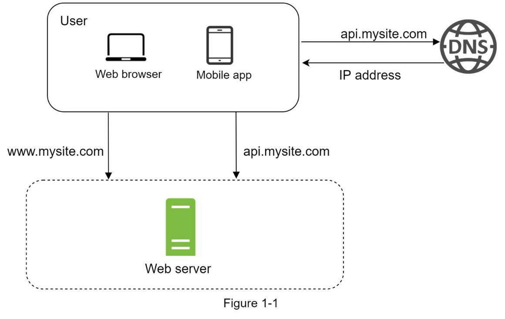

請求流程，如下圖：

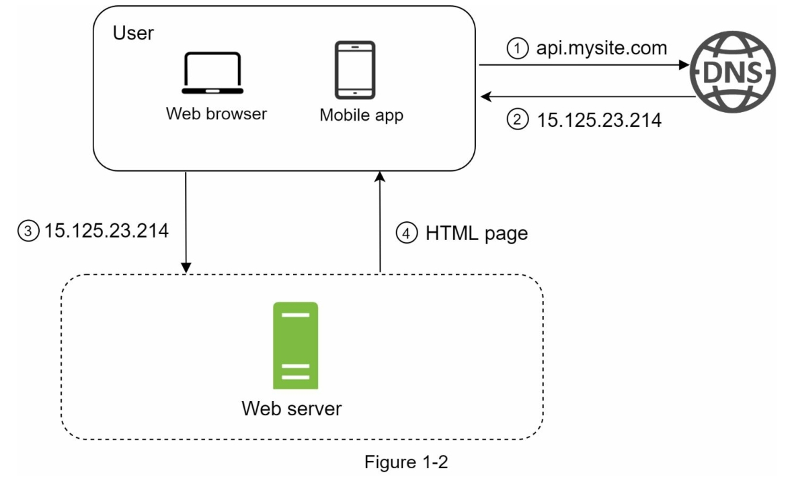

1. 使用者發出請求，透過網域 api.mysite.com 造訪網站。DNS（Domain Name System，網域名稱系統）就像網際網路的電話簿。它能將人類易讀的網域（如 google.com）轉換為電腦能理解的 IP 位址（如 142.250.190.46），讓瀏覽器順利載入網頁
2. DNS 解析後會把 Internet Protocol（IP）位址(15.125.23.214)會傳回給瀏覽器或行動應用程式
3. 獲得了 IP 位址後，就會直接向你的 Web 伺服器發送超文本傳輸協定請求(HTTP Request)。HTTP Request 是指用戶端（如瀏覽器）向伺服器發送的訊息，用來要求網頁、圖片或執行資料操作
4. Web 伺服器傳回用於渲染的 HTML 頁面或 JSON

### 面試 Q&A
> Q: 請描述從用戶輸入網址到看到網頁的過程中，單一伺服器架構下的請求流程為何？

> A: 需包含 DNS 解析、取得 IP 地址、發送 HTTP 請求以及伺服器回傳 HTML/JSON 的步驟

## 資料庫
隨著用戶數的成長，單一伺服器已經不夠，所以我們需要多個伺服器。一個用於處理 web/app（Web 層），一個用於資料庫（資料層），兩者獨立擴展


### 如何選擇要使用什麼樣的資料庫？
1. 關聯式資料庫(又稱作 SQL 資料庫/RDBMS 關聯式資料庫管理系統)：使用 table 來儲存資料，不同的 table 間可以透過 SQL 去執行連線操作！有主外鍵、唯一性約束等約束來確保資料一置性、ACID 特性，代表資料庫：MYSQL, Oracle, PostgreSQL
A: Atomicity (原子性)
C: Consistency (一致性)
I: Isolation (隔離性)
D: Durability (持久性)

2. 非關聯式資料庫(又稱作 NoSQL 資料庫)：適合超低延遲、資料無固定結構、你只需要序列化和反序列化資料（JSON、XML、YAML 等）或需要儲存海量資料的場景。代表資料庫：MongoDB, Amazon DynamoDB、CouchDB、Neo4j、Cassandra、HBase。通常不支援連線操作

### 面試 Q&A
> Q: 在什麼情況下你會選擇使用 NoSQL 而非傳統的關聯型資料庫？

> A: 當需要超低延遲、處理非結構化數據、僅需序列化/反序列化數據，或需要存儲海量數據時，NoSQL 是較佳選擇。

## 垂直擴展 VS 水平擴展
* 垂直擴展（縱向）： 增加單機硬體（CPU、RAM），但有物理限制且缺乏彈性，一旦當機全站就會壞掉
* 水平擴展（橫向）： 透過增加伺服器數量來分擔流量
垂直擴展有他的局限性，對於大型應用程式來說，水平擴展更為理想。

### 面試 Q&A
> Q: 垂直擴展（Vertical Scaling）有哪些主要限制？為什麼大規模系統傾向於水平擴展？

> A: 垂直擴展有硬體物理限制，且缺乏故障轉移（Failover）和冗餘，一旦單機故障則全站崩潰

## 負載平衡
### 為什麽需要負載平衡？
當使用者同時要存取一個網站，但已經達到了該網站伺服器的負載限制時，用戶通常會遇到響應較慢或無法連接到伺服器的情況，負載平衡就是要解決這個問題

### 負載平衡器(Load Balancer)
目的：將請求平均分配給多台 Web 伺服器，提高安全性並解決單點故障問題，提高系統的可用性


- 用戶直接連接負載平衡的公有 IP。透過此配置，客戶端不再直接存取 web 伺服器
- 為了提高安全性，負載平衡器透過私有 IP 與 Web 伺服器通訊。私有 IP 是指僅在同一網路中的伺服器之間可達的IP 位址。在網路上是不可訪問的
- 在新增了一個負載平衡器和第二個 web 伺服器後，提高了 Web 層的可用性
    - 若 Server1 下線，所有流量將被導向到 Server2
    - 如果網站流量迅速增長，兩台伺服器不足以處理流量，負載平衡可以處理這個問題，只需要向 web 伺服器池中添加更多的伺服器，負載平衡會自動發送請求給他們

### 面試 Q&A
> Q: 負載均衡器如何提高系統的可用性與安全性？

> A: 它能偵測伺服器健康狀態並自動導流；安全性方面讓 Web 伺服器能透過私有 IP 通訊，不直接暴露在網路

## 資料庫複製 Database Replication
為了提高資料庫的效能、可靠性與高可用性，在原始資料庫(master)與副本資料庫(slaves)之間建立主/從關係
- 主庫 (Master)： 負責寫入操作（Insert, Update, Delete）
- 從庫 (Slave/Replica)： 負責讀取操作，從主庫複製資料。能分散讀取壓力並在主庫失效時提供備援
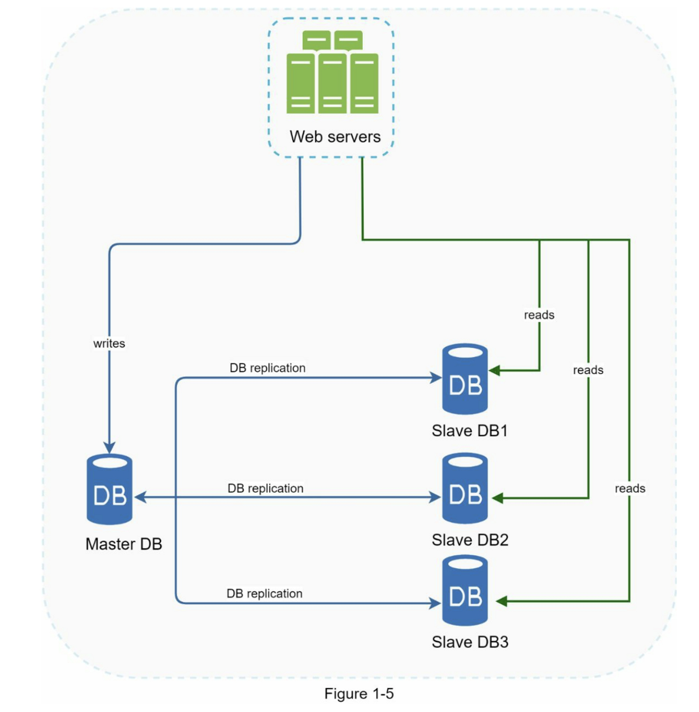

### 不同情境探討
* 如果只有一個從資料庫可用且它離線，讀取操作將暫時指向「主資料庫」
* 如果主資料庫離線，一個從庫會被提升為新的主庫(Failover)，所有的資料庫操作都會暫時在新的主庫上執行。一個新的從庫將會立即取代舊的從庫進行資料複製。提升一個新的主資料庫更為複雜，因為從庫中的資料可能不是最新的，遺失的資料需要透過執行資料復原腳本來更新。儘管一些其他的複製方法，如多主複製和循環複製，可能有所幫助，但他們的配置更加複雜

### 面試 Q&A
> Q: 請解釋主從架構（Master/Slave）的工作原理，以及當主庫（Master）當機時應如何處理？

> A: 主庫處理寫入，從庫處理讀取。主庫當機時，需提升一個從庫為新主庫，並可能需要運行數據恢復腳本處理延遲問題。

## 快取 Cache
* 一個臨時儲存的區域
* 快取層： 將頻繁訪問或運算成本高的資料存在記憶體中（如 Redis），減少資料庫負擔。Redis 常被用來做快取層
* 快取命中率：將快取能夠成功完成的內容請求數與所接收的請求數相對比的度量
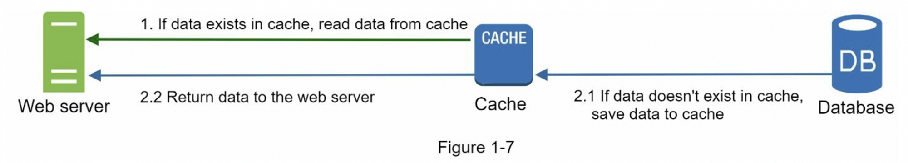

上圖這種快取策略稱為「讀取穿透快取」。根據資料類型、大小和存取模式，還有其他可用的快取策略
大多數快取伺服器提供了常見的 API。以下程式碼展示了典型的 Memcached API：
```javascript
SECONDS = 1
cache.set('myKey', 'hi there', 3600 * SECONDS)
cache.get('myKey')
```
### 使用快取的注意事項
* 何時使用快取：
    - 適合時機：當資料頻繁讀取但不經常修改時可使用快取
    - 不適合時機：快取不適合存放持久化資料，重要的資料應該保存在持久性資料儲存中
* 過期策略：實施過期策略是個好習慣，時間的拿捏視狀況而定。過期策略可確保快取資料不過時，釋放記憶體
* 一致性：保持資料儲存和快取同步。在跨多個區域擴展時，保持資料儲存和快取之間的一致性具有挑戰性（論文：[Scaling Memcache at Facebook](https://research.facebook.com/publications/scaling-memcache-at-facebook/)）
* 減少故障：單一快取伺服器代表了潛在的單點故障（SPOF），建議在不同資料中心使用多個快取伺服器，以避免單點故障。另一種方法是透過配置比所需的大小還多一定百分比的記憶體，這在記憶體使用量上升的時候起到一個緩衝的效果
* 驅逐策略：一旦快取滿了，任何嘗試向快取中添加內容的請求都可能導致現有項目被移除，稱為「快取驅逐」。最近最少使用（LRU）是常見的快取驅逐策略。其他逐出策略例如：最不常用（LFU）或先進先出（FIFO），以滿足不同的使用情境
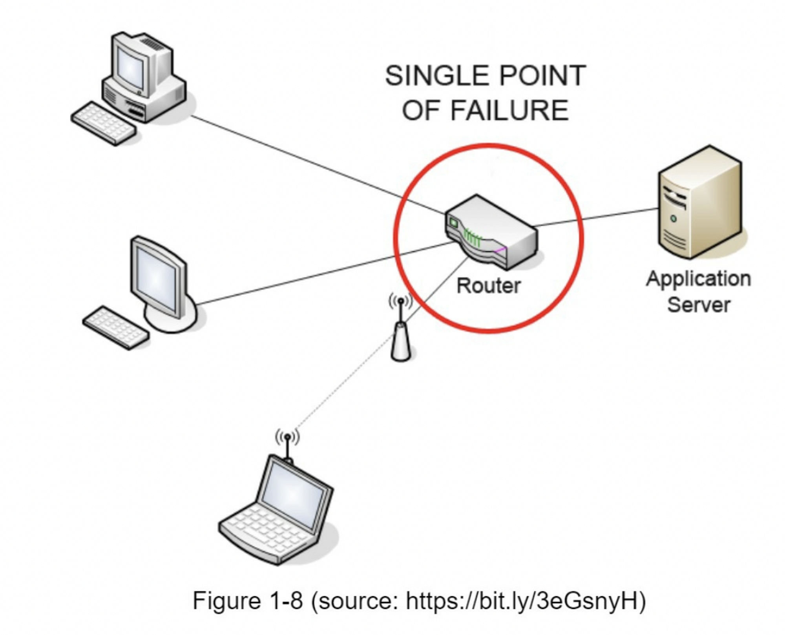

### 面試 Q&A
> Q: 在設計快取系統時，應考慮哪些關鍵因素？

> A: 需考慮資料更新頻率、過期策略（TTL）、快取與資料庫的一致性問題，以及如何避免單點故障（SPOF）

## CDN
CDN (Content Delivery Network) 內容傳遞網路，是一個由地理上分散的伺服器組成的網絡，也是快取的一種，用於提供靜態內容。CDN 伺服器快取靜態內容，如：圖片、影片、CSS、JavaScript 檔案等。

補充：
動態內容快取：是一個相對較新的概念

### 運作原理
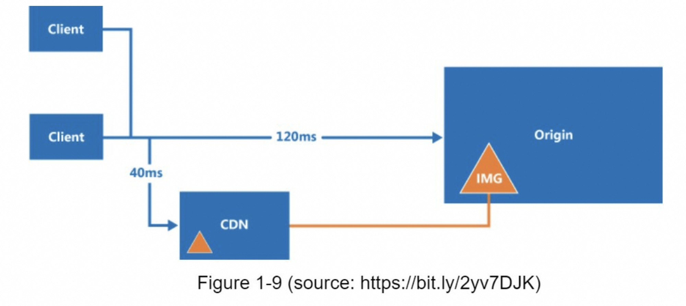
當使用者造訪一個網站時，距離使用者最近的CDN 伺服器將提供靜態內容，使用者距離 CDN 伺服器越遠，網站載入速度就越慢

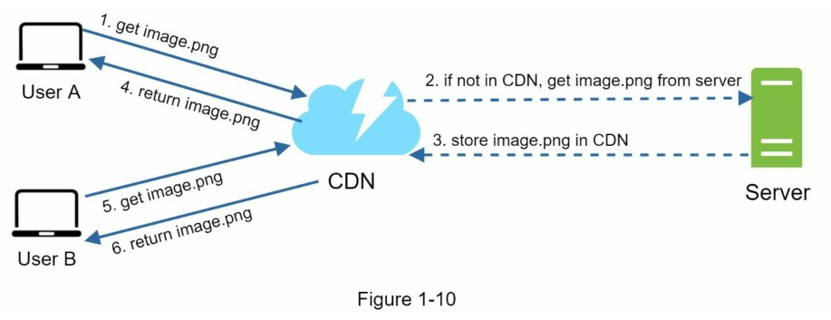

1. UserA 嘗試透過圖片 URL 取得 image.png。這個 URL 的網域是由 CDN 提供者提供
- https://mysite.cloudfront.net/logo.jpg (Amazon CDN)
- https://mysite.akamai.com/image-manager/img/logo.jpg (Akamai CDN)
2. 如果 CDN 中沒有這個圖片，CDN 伺服器會從來源（可以是 Web 伺服器或線上存儲，如 Amazon S3）請求檔案
3. 來源返回 image.png 給 CDN 伺服器，並包含可選的 HTTP Header Time-to-Live（TTL），代表影像被快取的時間有多長
4. CDN 快取影像並將其傳回給 UserA。在 TTL 過期之前，影像一直被快取在 CDN 中，所以 UserB 發送一個請求獲取相同的圖片，只要 TTL 尚未過期，就會從快取中拿取

### 使用 CDN 需要考慮的因素
* 成本：CDN 由第三方供應商運行，需要為進出 CDN 的資料傳輸付費
* 設定適當的快取過期時間：對於時間敏感的內容，設定快取過期時間是很重要的
* CDN 來源：應該考慮你的網站/應用程式如何處理 CDN 故障，如果出現臨時 CDN 中斷，客戶端應該能夠偵測問題並從來源請求資源
* 使檔案無效：在快取過期之前，可以透過執行以下操作之一從 CDN 中刪除檔案：
    - 透過 CDN 服務商提供的 API
    - 使用物件版本控制來提供不同版本的物件。對物件進行版本控制，可以在 URL 中新增參數例如版本號，例如：在查詢字串中新增版本號 2：image.png?v=2
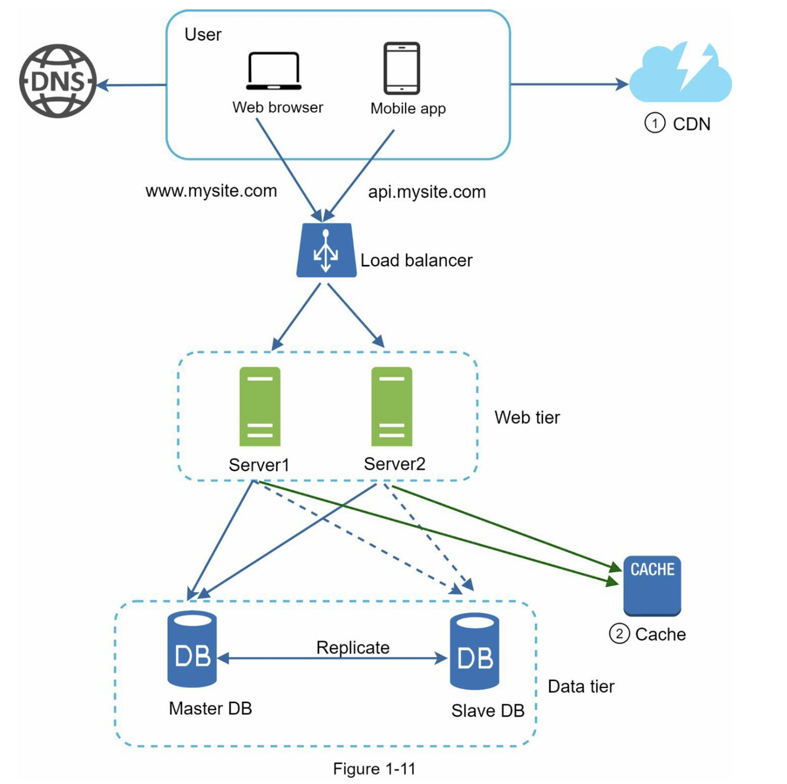

### 面試 Q&A
> Q: CDN 如何減少網頁載入延遲？如果 CDN 上的內容需要緊急更新，你會怎麼處理？

> A: 透過地理分佈的伺服器快取靜態資源。更新方式包含使用 CDN 提供商的 API 使其失效，或使用對象版本控制（如 image.png?v=2）

## 無狀態的 Web 層

### 有狀態架構
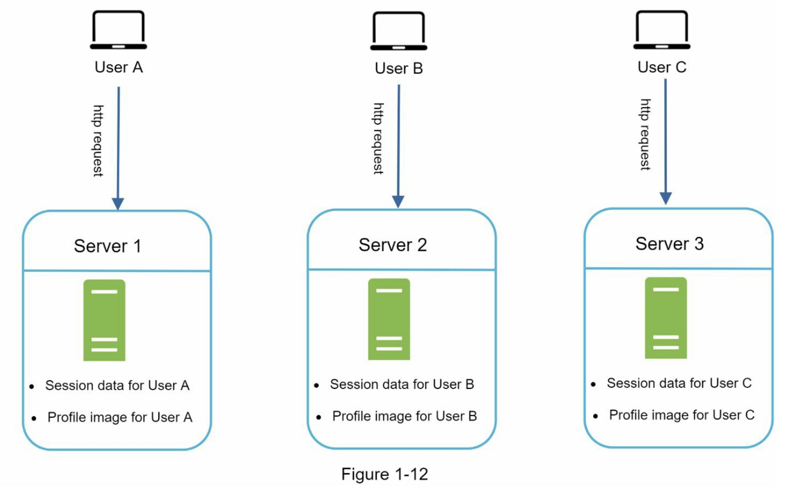
有狀態伺服器會在一個請求到下一個請求時記住客戶端資料(狀態)。有狀態架構的問題在於，來自同一客戶端的每個請求都必須路由到同一台伺服器。在大多數負載平衡器中，可以使用黏性會話（sticky sessions）來實現；但這會增加開銷，這種方法更難添加或刪除伺服器，處理伺服器故障也是一個挑戰

### 無狀態架構 Stateless Web Tier
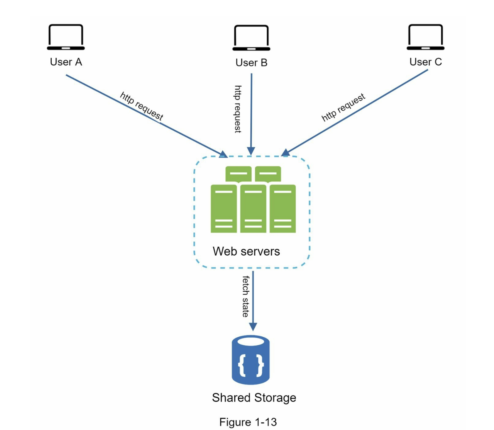
無狀態服務不會保留任何狀態資訊，為了更輕鬆水平擴展 Web 伺服器，應將用戶會話 (Session) 等狀態資料移出 Web 層，存儲在共享的持久化儲存，共享儲存可以是關聯和非關聯式資料庫、Memcached、Redis、NoSQL 等。這樣 Cluster 中任何一台 Web 伺服器都能從資料庫中存取狀態數據，這稱為無狀態的 Web 層

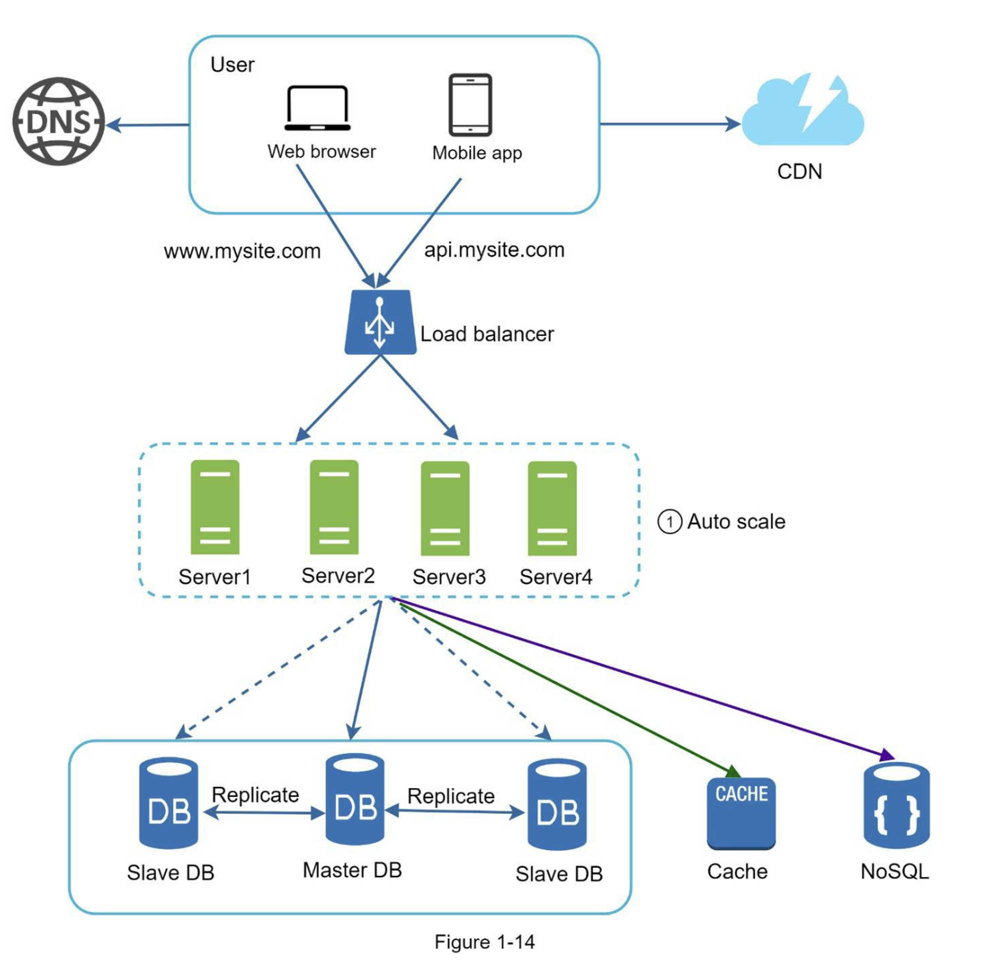
上圖中選擇 NoSQL 資料儲存是因為它易於擴展。自動擴充 = 根據流量負載自動新增或刪除 Web 伺服器。將狀態資料移出 Web 伺服器後，可以根據流量負載新增或刪除伺服器，實現 Web 層的自動擴充

### 面試 Q&A
> Q: 為什麼「無狀態（Stateless）」架構對於系統的水平擴展至關重要？

> A: 狀態架構將 Session 資料移至共享存儲（如 Redis），讓任何伺服器都能處理任何請求，避免粘性會話（Sticky Sessions）帶來的擴展限制。

## 資料中心 Data Centers
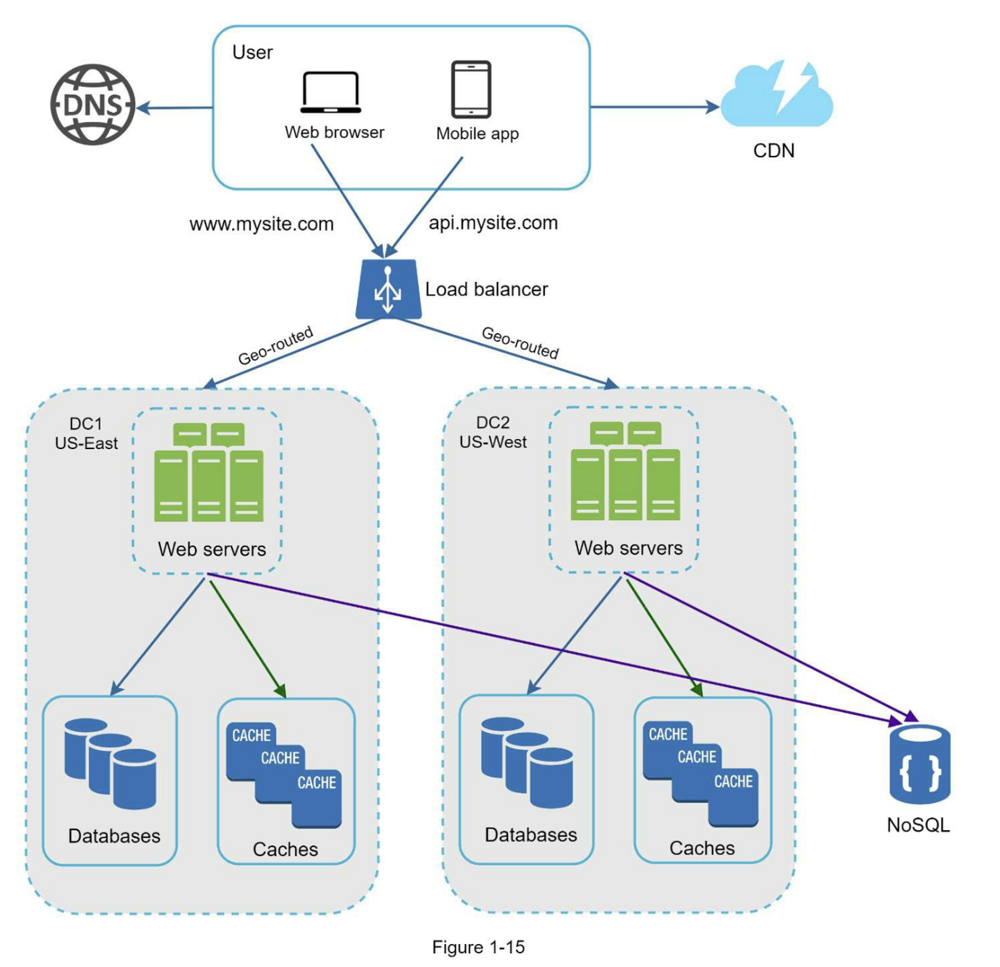
為了提高可用性並在更廣泛的地理區域提供更好的用戶體驗，支援多個資料中心很重要。透過 GeoDNS 路由(也稱為地理路由)根據用戶位置將流量引導至最近的資料ㄎ中心，並在某個中心故障時進行流量重定向

### 資料中心需要解決的技術難題
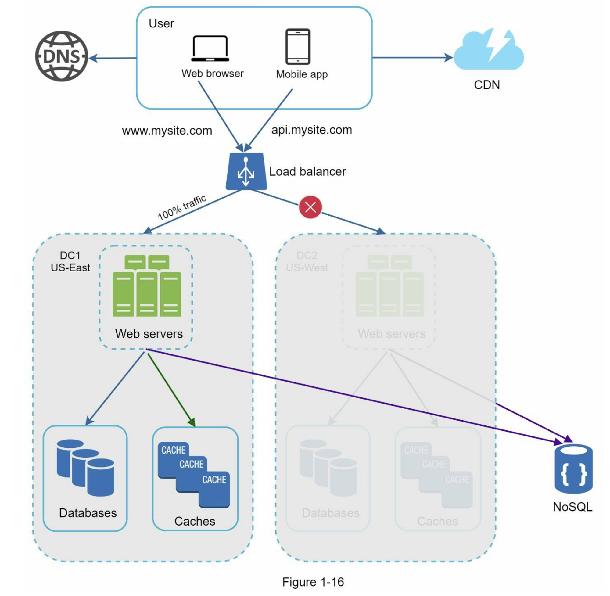

1. 流量重定向： geoDNS 可根據使用者位置將流量引導至離使用者最近的資料中心。
2. 資料同步：來自不同地區的使用者可以使用不同的本地資料庫或緩存，在故障轉移的情況下，流量可能會被路由到不可用的資料中心。一種常見的策略是跨多個資料中心複製資料，看看 Netflix 怎麼解決：[Active-Active for Multi-Regional Resiliency](https://netflixtechblog.com/active-active-for-multi-regional-resiliency-c47719f6685b)
3. 測試與部署：對於多資料中心設置，在不同位置測試非常重要，自動化部署工具對於保持所有資料中心的服務一致性有重要作用

### 面試 Q&A
> Q: 在多資料中心架構中，如何將用戶引導至正確的中心？有哪些技術挑戰？

> A: 使用 GeoDNS 根據用戶位置導流。挑戰包含流量重定向、跨地區數據同步以及自動化部署的一致性

## 訊息佇列 Message Queue
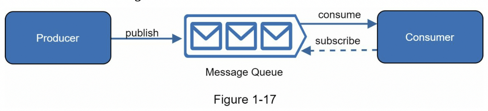
訊息佇列是一個持久性元件，儲存在記憶體中，支援非同步通信，充當緩衝區並分發非同步請求。解耦使訊息佇列成為首選架構，因其彈性。使用訊息佇列，生產者可以在消費者無法處理訊息時將訊息發佈到隊列中。即使生產者不可用，消費者也可以從隊列中取得資料

### 訊息佇列的基礎架構
1. 輸入服務，被稱為生產者/發布者
2. 建立訊息，並將它們傳送到訊息佇列中
3. 其他服務或伺服器，稱為消費者/訂閱者，連接到佇列，並執行訊息定義的動作

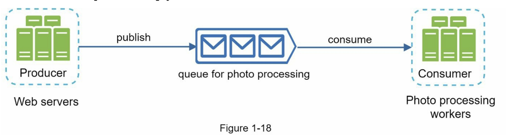

1. Web 伺服器將照片處理作業發佈到訊息佇列
2. 照片處理工作者從訊息佇列中取得作業並非同步執行照片自訂任務。生產者和消費者可以獨立擴展，當隊列的大小變得很大時，增加更多的工作者以減少處理時間。但是，如果隊列大部分時間為空，則可以減少工作者的數量。

### 面試 Q&A
> Q: 訊息佇列如何實現系統的「解耦」與「非同步處理」？請舉一個實際應用案例

> A: 生產者發送任務後即可返回，消費者非同步處理。例如：照片剪裁、銳化，讓 Web 伺服器不被耗時任務阻塞

## 日誌記錄、指標、自動化
### 日誌記錄：
監控錯誤日誌有助於識別系統中的錯誤和問題。可以在每個伺服器層級監視錯誤日誌或使用工具將它們匯總到一個集中的服務中，以便於搜尋和查看。

### 指標：
收集不同類型的指標有助於了解業務和系統的健康狀態，以下是一些常見指標：
- 主機層級的指標：CPU、記憶體、磁碟 I/O 等
- 聚合層級的指標：整個資料庫層、快取層的效能
- 關鍵業務指標：每日活躍用戶、留存數、收入等

### 自動化：
建立自動化工具來提高生產力。持續整合是一種很好的做法，其中每次程式碼提交都通過自動化進行驗證，使團隊能夠及時發現問題。此外，將建置、測試、部署流程等自動化，可以顯著提高開發人員的生產力
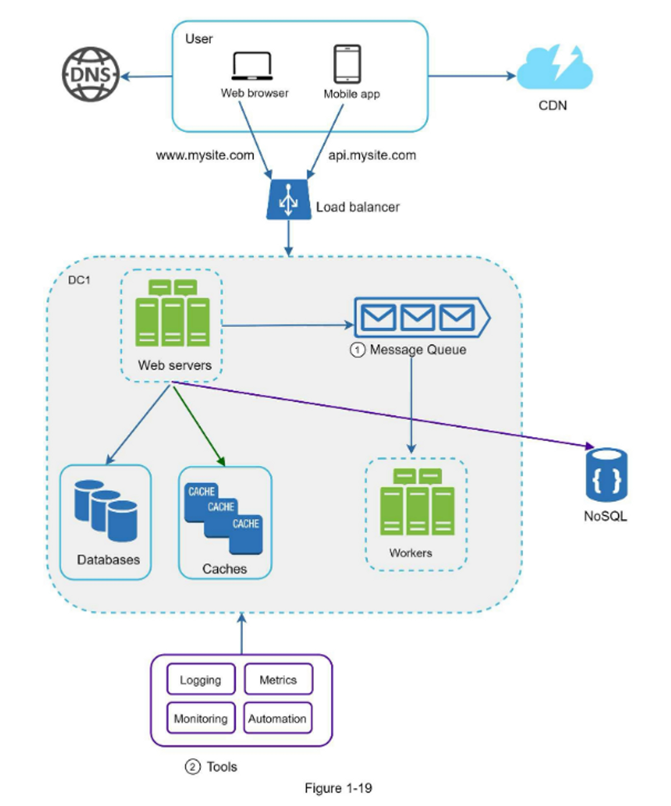

### 面試 Q&A
> Q: 對於一個大規模系統，你會監控哪些關鍵指標來確保系統健康？

> A: 主機級別（CPU/RAM）、聚合級別（資料庫/快取效能）以及業務指標（DAU/留存/收入）

## 資料庫擴充
隨著資料每天的成長，資料庫負載越來越重，是時候擴展資料層

### 垂直擴展
又稱向上擴展，透過向現有機器添加更多資源（如CPU、記憶體、磁碟等）來擴展
缺點：
* 硬體限制，如果你有龐大的用戶群，一台伺服器是不夠的
* 單點故障的風險更大
* 整體成本更高，強大的伺服器要貴得多

### 水平擴展
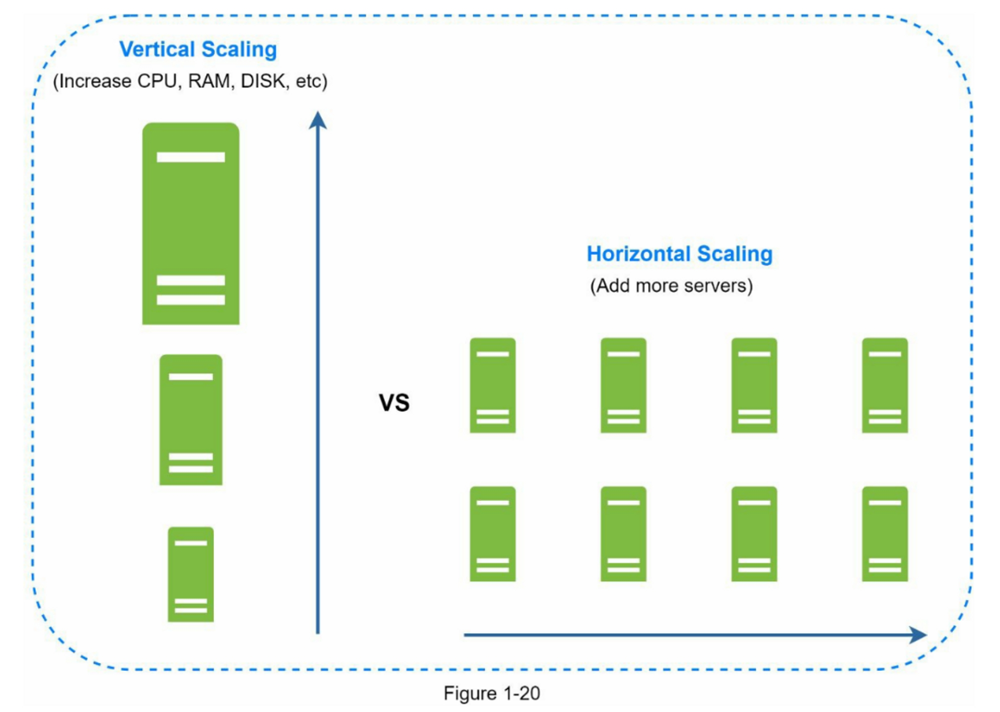
又稱為分片 (Sharding)，是添加更多伺服器來擴展。分片將大型資料庫分成更小、更易於管理的部分，稱為分片


上圖展示了一個分片資料庫的範例
* 用戶資料根據用戶 ID 分配到資料庫伺服器
* 每次存取資料時，都會使用雜湊函數來找到對應的分片。user_id % 4 被用作 hash 函數。如果結果為0，則使用分片 0 來儲存和提取資料。如果結果為 1，則使用分片 1

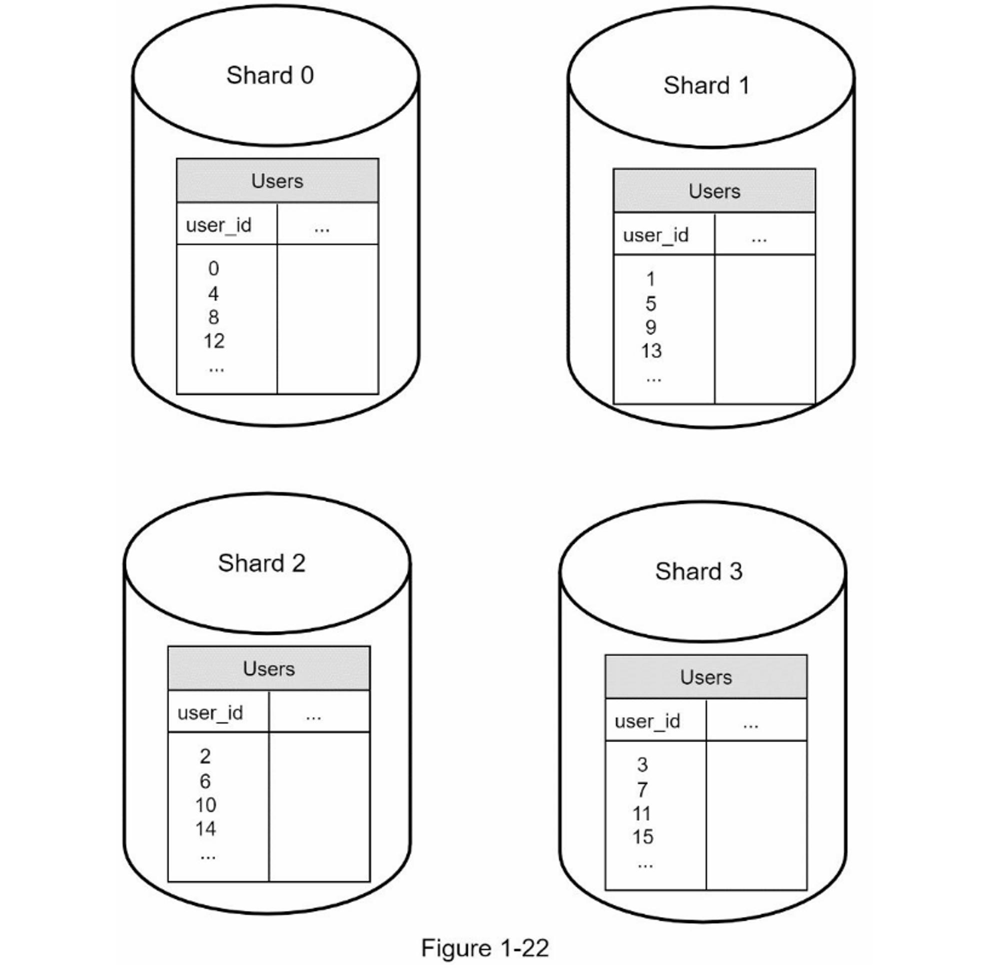
分片鍵（也稱為分區鍵）由一個或多個列組成，決定資料的分佈方式，如上圖的「user_id」是分片鍵。在選擇分片鍵時，最重要的指標是選擇一個可以均勻分佈資料的鍵

### 分片需考量的問題
在以下情況，需要重新分片資料
1. 由於資料流量快速增長，單一分片無法再容納更多數據
2. 由於資料分佈不均勻，某些分片可能比其他分片更快被耗盡，當分片耗盡時，需要更新分片功能並移動資料
3. 名人問題：這也被稱為熱點鍵問題。對特定分片的過度存取可能會導致伺服器過載。ex. Katy Perry、Justin Bieber、Lady Gaga 的數據最終都在同一個分片上，對於社交應用來說，這個分片將會被讀取操作淹沒。需要為每個名人分配一個分片，每個分片甚至需要進一步分區

連接與去範式：一旦資料庫跨多個服務分片，就很難跨資料庫分片執行連線操作。常見的解決方法是對資料庫進行去範式化，以便可以在單一表中執行查詢。

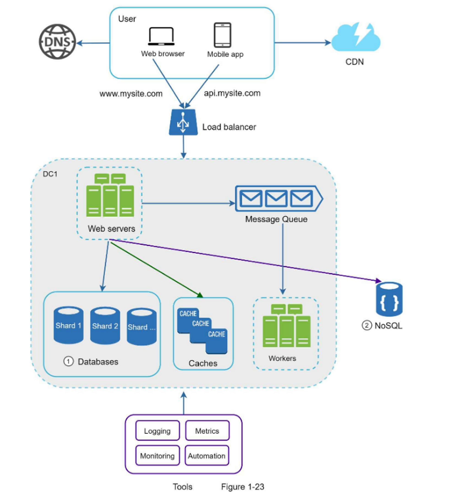

### 面試 Q&A
> Q: 什麼是資料庫分片（Sharding）？在選擇分片鍵（Shard Key）時應注意什麼？

> A: 分片是將數據分散到多個資料庫。選擇分片鍵最重要的是確保數據能「均勻分佈」，避免產生熱點鍵（Celebrity/Hotspot key）問題。
>