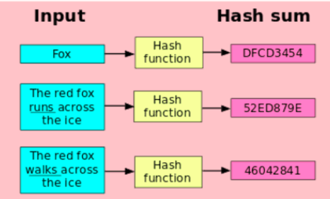
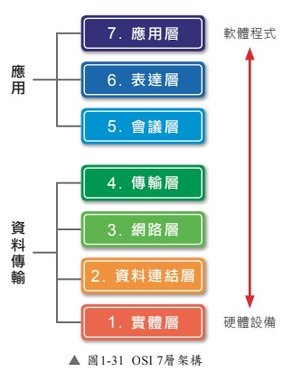

# [一致性 hash 設計](https://learning-guide.gitbook.io/system-design-interview/xi-tong-she-ji-mian-shi-nei-mu-zhi-nan-di-yi-juan/chapter-05-design-consistent-hashing)

### 學習重點
- 了解哈希值
- 哈希值對水平擴展的意義

## 前情提要
> Hash = 雜湊 = 哈希
Hash 是一種單向加密演算法，能將任意長度的輸入（例如：使用者 ID、伺服器 IP、圖片檔案等）轉換為固定長度的輸出值（通常是一串數字或雜湊值）。



## 為什麼要做「一致性哈希」設計？
讓「分散式系統」在水平擴展時，能在伺服器之間高效、均勻分配請求與資料。


## 傳統雜湊的限制：再哈希問題 (Re-hashing Problem)

傳統的負載均衡常用公式為：
> serverIndex = hash(key)mod N

* 優點：當伺服器數量固定且資料分佈均勻時，運作良好。
* 缺點：當新增或刪除伺服器時，伺服器總數 N 改變，導致幾乎所有 Key 計算出的伺服器索引都會改變，進一步引發快取失效（Cache Miss Storm），因為用戶端會連接到錯誤的伺服器來獲取資料。


PS. Cache Miss Storm
指當系統中的伺服器數量發生變動時，導致絕大部份的快取請求在一瞬間全部無法命中（Cache Miss）

## 一致性哈希

什麼是一致性哈希 (Consistent Hashing)？
> 「一致性哈希」是一種特殊的雜湊技術。其最大特點是：當調整雜湊表大小時，平均只需要重新映射 n/k 個鍵（其中 k 為鍵的數量，n 為槽/伺服器數量），只需要搬移系統中極小部分的資料。相比之下，傳統雜湊會導致幾乎所有的鍵都被重新映射，資料必須大遷徙。

**一致性哈希就是在避免資料大遷徙，讓系統能穩定擴張或縮減**

### 運作機制

1. 哈希空間與哈希環 Hash Ring： 假設使用 SHA-1 作為雜湊函數 f，其雜湊空間為 0 到 2
的 160 次方 − 1(若使用 CRC32，就是 2 的 32 次方)。將這條線性空間首尾相連，就形成了一個環，簡稱「哈希環」。
2. 伺服器映射： 使用相同的雜湊函數 f，根據伺服器的 IP 或名稱，將伺服器對應到圓環上的特定位置。
3. 鍵值映射： 將需要快取的鍵（Keys）同樣透過雜湊函數 f 映射到哈希環上
4. 伺服器查找： 要確定某個鍵存放在哪台伺服器，只需從該鍵在環上的位置出發，**順時針**方向尋找，直到遇到第一台伺服器
5. 新增/移除伺服器的影響：
    * 新增伺服器： 僅需重新分配極少數的鍵。例如，在環上新增 server4 後，只有介於前一台伺服器與 server4 之間的鍵會被重新分配給 server4，其他鍵的存放位置完全不受影響。
    * 移除伺服器： 當 server1 被移除時，只有原本存放在 server1 的鍵需要順時針重新映射到下一台伺服器 server2，其餘的鍵皆不受影響。


---

目前有三台伺服器，分配到三個不同位置
```
        🖥️ 伺服器 A
      /            \
     /              \
    /                \
🖥️ 伺服器 C ------ 🖥️ 伺服器 B
```

```
        🖥️ 伺服器 A
      /            \
     /           👉 💾 (有一筆新資料進來)
    /                \
🖥️ 伺服器 C ------ 🖥️ 伺服器 B
```

Q: 根據上面的相對位置，新資料最終會交給哪一台伺服器來保管呢？

伺服器 B 突然發生故障，必須從圓環上被移除。現在圓環上只剩下 A 和 C
```
        🖥️ 伺服器 A
      /            \
     /           👉 💾 (原本交給 B 的照片)
    /                \
🖥️ 伺服器 C ------ ❌ (B 故障消失了)
```
Q: 根據上面的相對位置，新資料會交接給哪一台伺服器呢？


## 一致性哈希會遇到的兩個問題
現實中，雜湊函數算出來的位置是隨機的。所以伺服器在圓環上的分布也不是平均的。

### 問題一：分區大小不均勻
由於伺服器數量是動態的，無法保證環上每台伺服器分配到的分區大小相同，可能導致某台伺服器的分區極大，而另一台極小。

### 問題二：鍵分佈不均勻
鍵在環上的分佈可能不平均，導致大量資料集中在某一台伺服器上，而其他伺服器幾乎處於閒置狀態，失去了分散式系統分攤壓力的意義。


以上問題的解法 👉 虛擬節點 (Virtual Nodes) 👈

## 虛擬節點

每一台真實伺服器在環上由多個虛擬節點（分身）來表示，例如：讓實體伺服器 A 擁有 A1, A2, A3... ；伺服器 B 也有 B1, B2, B3...。

```
(起點 0)
         |
         |👉 虛擬節點 A1 (實際上存到 伺服器 A)
         |
         |👉 虛擬節點 B1 (實際上存到 伺服器 B)
         |
         |👉 虛擬節點 C1 (實際上存到 伺服器 C)
         |
         |👉 虛擬節點 A2 (實際上存到 伺服器 A)
         |
         |👉 虛擬節點 B2 (實際上存到 伺服器 B)
         |
         |👉 虛擬節點 C2 (實際上存到 伺服器 C)
         |
         |👉 虛擬節點 A3 (實際上存到 伺服器 A)
         |
         |👉 虛擬節點 B3 (實際上存到 伺服器 B)
         |
         |👉 虛擬節點 C3 (實際上存到 伺服器 C)
         |
       (繞回 0)
透過切碎並交錯的方式，平衡負載
```
隨著虛擬節點數量的增加，標準偏差會變小，資料在伺服器之間的分佈會變得更加平均。但是這需要更多空間來存儲虛擬節點的數據，因此需要根據系統需求在分佈均勻度與儲存空間之間進行權衡。


## 如何找出受影響的鍵 (Affected Keys)
當環上的節點發生變動時，受影響需要重新分配的資料範圍如下：

* 新增伺服器：受影響範圍從新節點開始，逆時針方向移動直到遇到第一台伺服器，這段區間內的鍵必須重新分配給新節點。
* 移除伺服器：受影響範圍從被移除的節點開始，逆時針方向移動直到遇到第一台伺服器。這段區間內的鍵必須重新分配給被移除節點順時針方向的下一個節點。

## 一致性雜湊的優點與實際應用
優點：
* 伺服器擴展或縮減時，僅有極少部分的鍵需要重新分配。
* 資料分佈更均勻，使系統更易於進行水平擴展。
* 能有效緩解熱點鍵（Hotspot/Celebrity Key）問題，避免特定分區因過度訪問而超載。

現實中的實際應用：
* Amazon DynamoDB
* Apache Cassandra 的跨叢集數據分區
* Discord 聊天應用
* Akamai 內容傳遞網路 (CDN)
* Maglev 網路負載均衡器


## 補充
Load Balancer 本身就是用一致性雜湊實現的嗎？

> 不一定。
>
> 大多數 Layer 4（傳輸層）LB 不會使用一致性雜湊，像是在機房門口分發 TCP 連線的 LB，它們通常使用更簡單、效能更高的演算法：
>
> * 輪詢（Round Robin）： 不管請求是誰，大家輪流分配到伺服器 A, B, C。
> * 最小連線數（Least Connections）： 哪台伺服器現在連線最少，新連線就給誰。
>
> 只有 Layer 7（應用層）的「有狀態」或「快取」LB 才會使用一致性雜湊：
>
> **【分散式快取的負載平衡】：**
>
> 以購物車內的資料來說，LB必須確保同一個用戶（相同的 User ID Key）的請求，被分發到同一台後端快取伺服器。
>
> **【有狀態服務】：**
>
> 例如線上遊戲伺服器、即時聊天伺服器。同一個房間或同一個對話的使用者，必須在同一台機器上才能互相通訊。LB 就會利用房間 ID 或使用者 ID 作為 Key，透過一致性雜湊將他們導向同一台機器。




## 面試情境題：分散式相簿快取系統

假設你正在為一個高流量的相簿網站設計快取系統。目前系統在哈希環上部署了三台快取伺服器：server0、server1、server2。 此時，有許多相片的鍵（Keys，例如 photo101、photo102）已經透過雜湊函數映射到環上，並以順時針方向尋找最近的伺服器進行儲存。

突發狀況： 半夜時，server1 因為硬體故障突然當機並被系統移除。
請回答以下問題：
1. 受影響的範圍是什麼？ 在哈希環上，哪些位置之間的鍵（Keys）會受到影響而需要重新分配？
2. 重新分配去哪裡？ 這些受影響的鍵，最終會被重新分配到哪一台保留下來的伺服器上？


答案：
1. 受影響的範圍是什麼？
前提假設：假設這三台伺服器在哈希環上的順時針排列順序是：server0 → server1 → server2 → 回到 server0
受影響的範圍是落在「server1 的逆時針前一台節點」與「server1 本身」之間的這段區間。介於 server0 與 server1 之間的所有相片 Keys。在這個區間之外的其他 Keys，因為順時針尋找的結果沒有改變，所以完全不受影響。

2. 重新分配去哪裡？
這些受影響的 Keys 會被重新分配給「server1 順時針方向的下一台伺服器」。依照假設的順序來說，就會是 server2。

💡 面試加分項（Pro Tip）：展現資深思維

回答標準答案能拿到基本分，但要拿到高分，應該主動點出這個情況帶來的潛在問題，並提出解法：
```
「雖然資料成功轉移到了 server2，但這會衍生出一個問題：server2 瞬間必須承受原本 server1 的全部流量，這可能導致 server2 因為負載過高也跟著當機，進而引發雪崩效應 (Cascading Failure)，讓伺服器一台接一台故障。

為了解決這個問題，我會在系統設計時引入虛擬節點 (Virtual Nodes)。這樣當某台實體伺服器當機時，它的數百個虛擬節點會從環上消失，其原本負責的流量會被均勻地打散、分攤給環上剩餘的伺服器，而不是只壓在相鄰的單一一台機器上。」
```
