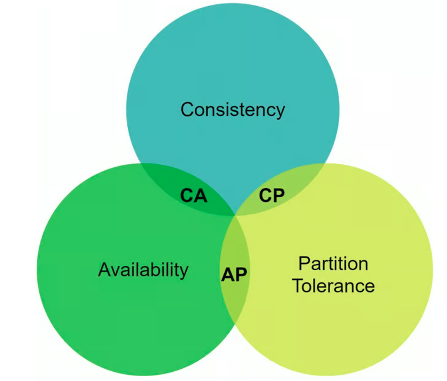
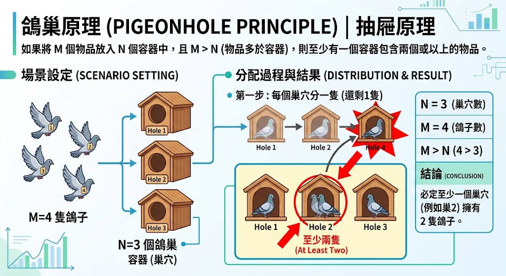
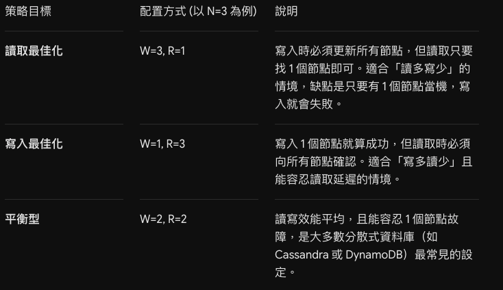

# [key-value 儲存設計](https://learning-guide.gitbook.io/system-design-interview/xi-tong-she-ji-mian-shi-nei-mu-zhi-nan-di-yi-juan/chapter-06-design-a-key-value-store)

### 學習重點
- 了解 key-value 儲存設計
- 設計一個支援以下操作的鍵值儲存：
```
put(key, value)// 插入與 key 關聯的 value
get(key)// 取得與 key 關聯的 value
```

## 前情提要
> key-value 儲存也稱為「鍵值資料庫」，屬一種「非關聯」資料庫，鍵必須是唯一的且由純文字或雜湊值組成

例如：

- 純文字鍵：“last_login_at”
- 哈希鍵：253DDEC4

> 值通常被視為不透明的對象，值可以是字串、列表、物件等，如 Amazon dynamo, Memcached, Redis


## 設計一個支援以下操作的鍵值儲存：
```
put(key, value)// 插入與 key 關聯的 value
get(key)// 取得與 key 關聯的 value
```

### 定義問題並確定設計範圍

設計包含以下特徵的鍵值儲存：
1. 鍵值對的大小很小：不到 10 KB
2. 有能力儲存大數據
3. 高可用性：系統反應迅速，即使在發生故障時也是如此
4. 高可擴展性：系統可以擴展以支援大數據集
5. 自動縮放：伺服器的新增/刪除應該會根據流量自動進行
6. 可調節的一致性
7. 低延遲

## 分散式鍵值存儲

### CAP 理論（又稱布魯爾定理）
* C（Consistency）一致性：有客戶端無論連接到哪個節點，都在同一時間看到相同的資料
* A（Availability）可用性：
* P（Partition Tolerance）分區容錯性：

一個分散式計算系統無法同時完全滿足一致性（Consistency）、可用性（Availability）與分區容錯性（Partition Tolerance）這三個核心要素，最多只能同時兼顧其中兩項



| 系統類型 | 一致性（Consistency） | 可用性（Availability） | 分區容錯性（Partition Tolerance） | 說明 |
|---|---|---|---|---|
| **CP** | ✅ 支援 | ❌ 犧牲 | ✅ 支援 | 發生網路分區時，為確保資料一致，可能拒絕或延遲部分請求。 |
| **AP** | ❌ 犧牲 | ✅ 支援 | ✅ 支援 | 發生網路分區時仍接受請求，但不同節點的資料可能暫時不一致。 |
| **CA** | ✅ 支援 | ✅ 支援 | ❌ 犧牲 | 無法容忍網路分區；由於網路故障難以避免，通常不適用於跨網路的分散式系統。 |

> CAP 定理的核心：發生網路分區（P）時，系統必須在一致性（C）與可用性（A）之間做出取捨

## 分散式鍵值存儲的核心元件和技術

### 1. 資料分割區
> 對應到 CH5 的一致性雜湊和哈希環。簡單來說，分散式系統的資料必須跨多個伺服器平均分配資料，且當節點被新增或刪除時，盡量減少資料移動。

### 2. 資料複製
> 由於停電、網路問題、自然災害等原因，同一資料中心內的節點經常同時發生故障。為了更好的可靠性和可用性，副本被放置在不同的資料中心（伺服器），資料中心之間透過網路連接。

### 3. 一致性
> 同一筆資料可能複製到不同的伺服器節點上，所以必須跨副本同步
Quorum （法定人數）機制，是一種分散式系統中常用的，用來保證資料冗餘和最終一致性的投票演算法，其主要數學思想來源於鴿巢原理 (Pigeonhole Principle)。



> Quorum 的三個核心參數
- N (Nodes)： 系統中儲存資料的總副本數量
- W (Write Quorum)： 一次寫入操作要被判定為「成功」，必須確認已寫入的節點數量
- R (Read Quorum)： 一次讀取操作要被判定為「成功」，必須確認讀取的節點數量

**強一致性的法則：W + R > N**

常見的配置情境：


- **強一致性（Strong Consistency）**：寫入成功後，後續讀取都能取得最新資料，確保 Client 不會讀到過期資料。通常是透過強迫一個副本不接受新的讀/寫，直到每個副本都同意當前的寫來實現的。這種方法對於高可用系統來說並不理想，因為可能會阻塞新的操作
- **弱一致性（Weak Consistency）**：寫入成功後，在資料尚未同步完成的暫時狀態下，Client 仍可能讀到舊資料
- **最終一致性（Eventual Consistency， 推薦✨）**：基於弱一致性的延伸，允許各副本在短時間內存在不一致，但經過一段時間後，最終會收斂為一致的資料狀態。Dynamo 和 Cassandra 是採用此方式

### 4. 不一致解決方案：版本控制

版本控制：將每個資料修改視為一個新的不可更改的資料版本。但有可能遇到同時修改的衝突，所以就會需要一個系統去偵測衝突並協調衝突
👉 向量時鐘

### 5. 故障處理

### 6. 系統架構圖

### 7. 寫入路徑

### 8. 讀取路徑


## 面試情境題：

