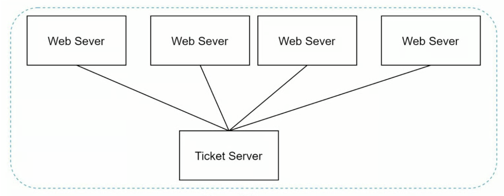
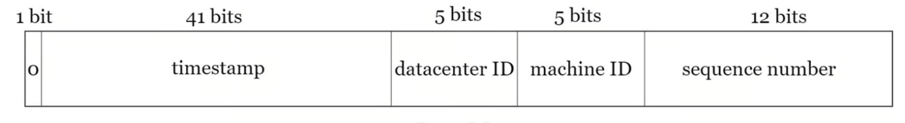

# [分散式系統中設計唯一ID 生成器](https://learning-guide.gitbook.io/system-design-interview/xi-tong-she-ji-mian-shi-nei-mu-zhi-nan-di-yi-juan/chapter-07-design-a-unique-id-generator-in-distributed-systems)

### 學習重點
- 了解分散式系統的 ID 生成器

### 前情提要
在傳統資料庫中使用具有 auto_increment 屬性的主鍵，但是 auto_increment 在分散式環境中起不了作用

### 在分散式系統中設計 ID 生成器

#### 多主複製：參考資料庫的 auto_increment 特性，但不是將下一個 ID 增加 1，而是將其增加 k。k --> 正在使用的伺服器數量

- 優點：極高的寫入可用性、寫入負載分流
- 缺點：
    - 難以透過多個資料中心進行擴展
    - ID 在多個伺服器上不隨時間而成長
    - 在增加或刪除伺服器時，不能很好的擴展

#### 通用唯一識別碼(UUID)：
UUID 是一個 128 位數字，用於識別電腦系統中的信息。 其發生碰撞的機率非常低，例如：`09c93e62-50b4-468d-bf8a-c07e1040bfb2`

- 優點：
    - 簡單且不易出現有不同步的問題
    - 適合分散式與微服務架構
    - ID 是全域唯一性
- 缺點：
    - 儲存空間消耗較大(128 位元 = 16 位元組)
    - 可讀性與除錯體驗差、資料庫索引效能較差（非連續性）
    - ID 不會隨時間增加

為了改善傳統 UUID，近幾年出現了像是 UUIDv7，ID 具備時間地曾姓

#### Ticket 伺服器（Ticket Server）

Ticket 伺服器（Ticket Server） 主要指專門用來生成全域唯一且遞增 ID 的獨立服務（例如 x(Twitter) 開源的 Snowflake 演算法服務，或 Flickr 採用的集中式 MySQL Auto-Increment 方案）

- 優點：
    - 保證絕對遞增與順序性
    - 生成的 ID 短小且節省空間(64 位元 = 8 位元組)
    - 架構直觀且維護相對簡單
- 缺點：單點故障風險

#### x (Twitter) 雪花演算法
雪花演算法（Twitter Snowflake） 是 Twitter（現 X）於 2010 年開源的分散式 ID 生成演算法。在不依賴中央資料庫與網路協調的前提下，由各節點高效生成全域唯一、時間遞增的 64 位元整數 ID。

例如：`0 - 00000000 00000000 00000000 00000000 00000000 0 - 00000000 00 - 00000000 0000`

- 1 bit 符號位（Sign Bit）：固定為 0，確保生成的數字為正整數

- 41 bit 時間戳記（Timestamp）：記錄相對於「自訂起始時間（Custom Epoch，例如系統上線時間）」的毫秒數

- 10 bit 機器識別碼（Machine ID / Node ID）：代表生成 ID 的服務節點。 支援最多 1,024 台機器同時運行。原生實作常拆分為 5 bits DataCenter ID（資料中心）+ 5 bits Worker ID（工作節點）

- 12 bit 毫秒內序列號（Sequence Number）：單一機器在「同一毫秒之內」累積的計數器。單台機器每毫秒最多可產生 4,096 個 ID

- 優點：
    - 高效能與高吞吐量
    - ID 隨時間遞增
    - 儲存空間精省
    - 去中心化與高可用（沒有單點故障的風險）
- 缺點：
    - 伺服器時鐘回撥問題。演算法強烈依賴系統時間，若伺服器發生 NTP（Network Time Protocol，網路時間協定） 時間同步修正、閏秒或時鐘回撥，可能導致產生重複的 ID
    - 營運壽命限制（約 69 年）

由於原始 Snowflake 存在時鐘回撥等問題，業界衍生許多優化版本：

- 美團 Leaf-Snowflake：結合 Zookeeper 動態管理 WorkId，並加入時鐘回撥容錯與等待機制
- 百度 UidGenerator：基於 Java 的 Snowflake 變體，採用 RingBuffer 快取機制提前生成 ID，降低時鐘敏感度
- Sony Sonyflake：日本 Sony 開源版本，延長時間戳記位元（改為 10ms 為單位，可使用 174 年），並擴大機器節點數