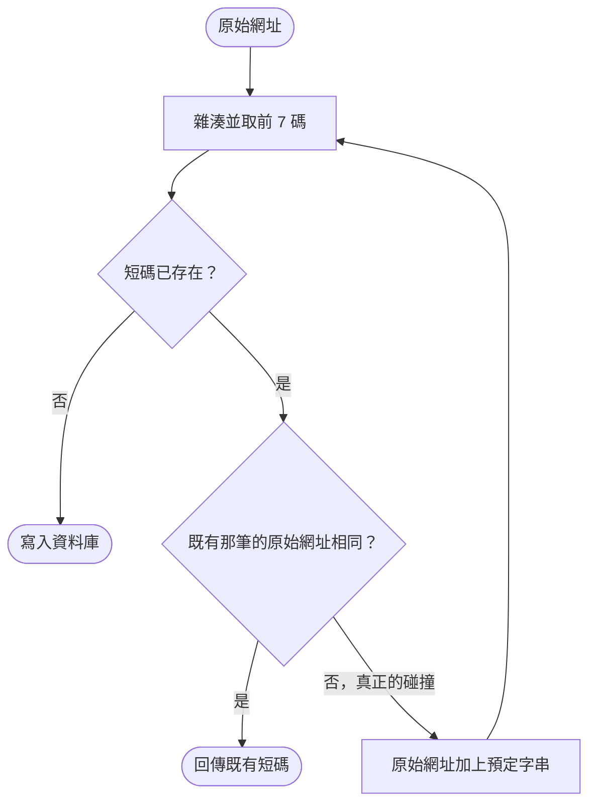
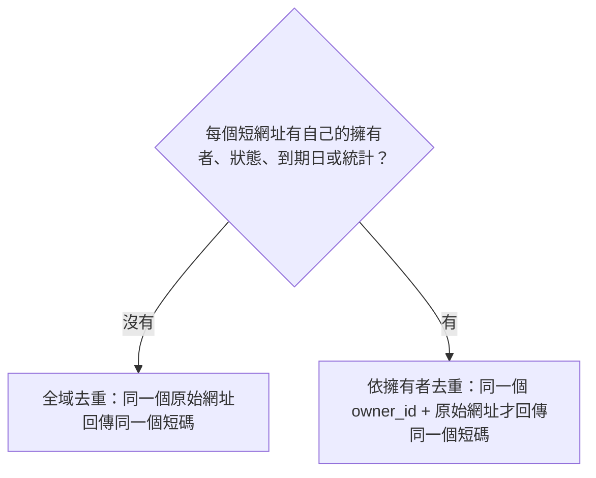
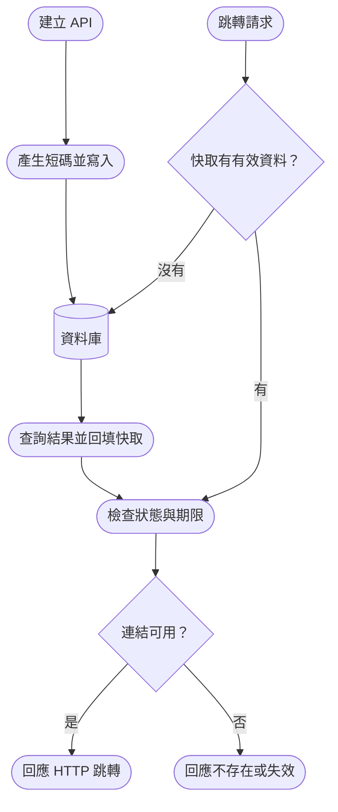
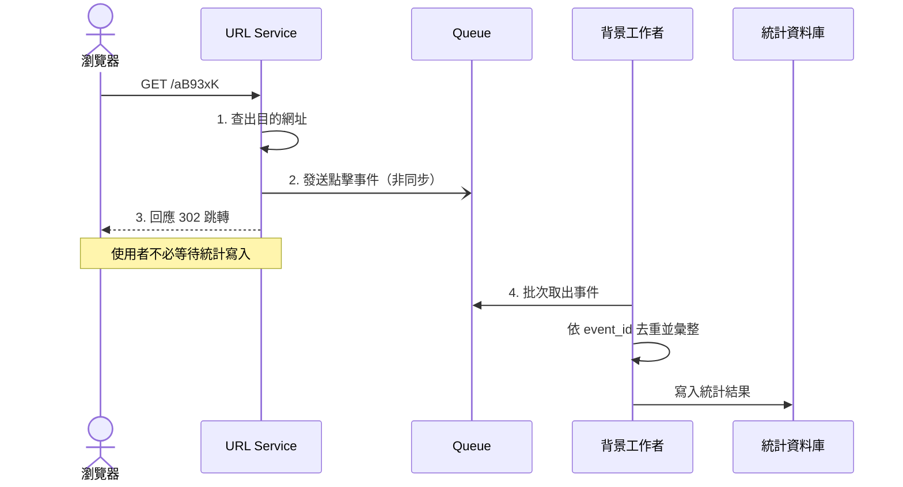
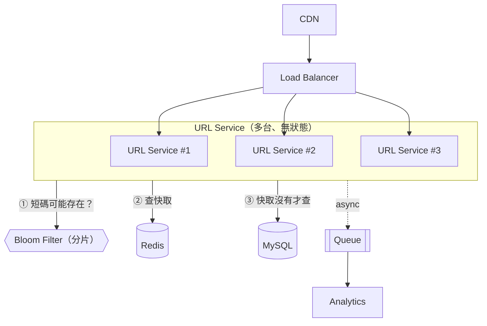

# [設計短網址系統](https://learning-guide.gitbook.io/system-design-interview/xi-tong-she-ji-mian-shi-nei-mu-zhi-nan-di-yi-juan/chapter-08-design-a-url-shortener)

## 1. 設計前的背景知識：

短網址的核心是建立一份 「短網址 → 原始網址」的對照表

```
原始網址：https://example.com/articles/system-design?source=facebook
短網址：  https://short.com/aB93xK
```

### 1.1 運作流程

1. 使用者透過送出按鈕，把短網址透過 API 傳送到後端
2. 驗證使用者的輸入是否合規，是可接受的網址，例如限制為 https://、http://
3. 檢查長度、使用者權限、建立次數限制
4. 產生一個尚未使用的短碼
5. 把短碼與原始網址存入 DB
6. 回傳組合好的短網址



### 1.2 使用者點擊短網址時，實際發生什麼事？

> 以 https://short.com/aB93xK 為例

1. 瀏覽器會先解析網域的 IP、建立連線與 TLS，接著送出 HTTP 請求
2. 短網址服務收到請求後，從路徑取出 `aB93xK`，並做 SQL 查詢
3. 確認連結存在、沒有過期、沒有停用後，回應：

```
HTTP/2 302 Found

Location: https://example.com/articles/system-design?source=facebook|
Cache-Control: no-store
```

瀏覽器看到 Location，就會向原始連結發出另一個請求

完整流程包含兩次請求

| 請求   | 對象       | 功能                               |
| ------ | ---------- | ---------------------------------- |
| 第一次 | 短網址服務 | 查詢目的地，取得跳轉回應(redirect) |
| 第二次 | 原始網站   | 取得真正的網頁內容                 |



### 1.3 常見的 3xx 狀態碼

HTTP 3xx 狀態碼：重新導向（Redirection）

| 狀態碼 | 意義                                       | 對短網址設計的影響                                   |
| ------ | ------------------------------------------ | ---------------------------------------------------- |
| `301`  | 永久跳轉，網站換網域或永久改版時使用       | 可能被快取；日後更改目的地時，既有快取可能指向舊網址 |
| `302`  | 暫時跳轉，網頁維護、促銷活動等短期跳轉使用 | 適合目的地可能更動的連結，快取行為須搭配標頭管理     |
| `307`  | 暫時跳轉，保留 HTTP Method 與請求內容      | 適合需要保留 POST 等方法的情境                       |
| `308`  | 永久跳轉，保留 HTTP Method 與請求內容      | 永久移轉且需要保留請求方法的情境                     |

### 1.4 短網址怎麼產生？

常見有三種方法：

1. 轉成 Base62

  > Base62 只會有英數字，處理方便。此外，Base62 是編碼，不是加密，知道編碼規則的人，可以把短網址轉回數字，甚至推測服務規模。base62 不會發生碰撞，因為不同的英數字一定得到不同的字串。

PS. Base64 編碼可能有 `/`，容易與路徑分隔混淆，需額外處理。

**補充：用費斯妥密碼（Feistel cipher）打亂 ID**

Base62 的問題是知道編碼規則的人，可以把短網址轉回數字或從 ID 差距推算每天產生多少短網址。

👉 解法：費斯妥密碼

> 費斯妥密碼是一種用來設計「對稱式加密演算法」的結構，本身不是某個特定的演算法。DES、Blowfish 都是照這個結構實作

對稱式：加密、解密都用同一把金鑰

```
ID 1000 ──(金鑰 K 加密)──→ 734812093551
734812093551 ──(金鑰 K 解密)──→ ID 1000
```

Feistel 保證「一對一」：不同的輸入一定得到不同的輸出，所以打亂後仍然不會發生碰撞。

| 問題 | 結果 |
| ---- | ---- |
| 相鄰 ID 產生相鄰短碼，可以列舉 | ✅ 解決，相鄰 ID 的結果看起來毫無關係 |
| 從短碼推回 ID、推測服務規模 | ✅ 解決，沒有金鑰就解不回來 |
| 碰撞 | ✅ 仍然不會碰撞，不需要查 DB 檢查 |
| 需要唯一 ID 產生器 | ❌ 沒解決，還是要用 CH7 的分散式 ID 產生器 |


2. 產生隨機短碼

  > 從 62 個字元（0-9、a-z、A-Z）隨機挑。

3. 對原始網址進行雜湊，再截取部分字元

  > 雜湊函式可以把任意長度的輸入，變成固定長度的輸出。同樣的輸入一定得到同樣的輸出，因為只截取部分字元，所以是有可能發生碰撞的(hash collision)。

⚠️ 發生碰撞時的處理：在網址後面加一段預定的字串，重新雜湊，直到不衝突為止。



PS. 「比對原始網址是否相同」是補充的步驟，書上的流程只檢查短碼是否存在。少了這步，同一個網址送第二次會被誤判成碰撞，產生另一個短碼。


## 2. 定義需求

> Q1. 確認流量是多少
>
> A1: 每天產生一億個 URL

> Q2. 縮短後的 URL 是否有限制長度
>
> A2: 越短越好

> Q3. 縮短後的 URL 中允許使用哪些字元
>
> A3: 短網址可以是數字（0-9）和字元（az，AZ）的組合，所以每個位子有 62 種選擇

> Q4. 縮短的 URL 是否可以刪除、更新
>
> A4: 縮短後的 URL 不能被刪除或更新


## 3. 粗估系統量級

> 目的：算出大概的流量與資料量，數量級對就好，並用結果推導設計決策

| 項目 | 假設 / 算式 | 結果 |
| ---- | ----------- | ---- |
| 寫入 QPS | 1 億 ÷ 24 ÷ 3600 | 約 1,160 次/秒 |
| 讀取 QPS | 假設讀:寫 = 10:1 → 1,160 × 10 | 約 11,600 次/秒 |
| 總筆數 | 跑 10 年 → 1 億 × 365 × 10 | 3,650 億筆 |
| 儲存空間 | 平均 URL 長度 100 bytes → 3,650 億 × 100 bytes | 36.5 TB |
| 讀取尖峰(補充) | 11,600 次/秒 × 2～3 | 約 35,000 次/秒 |
| 快取大小(補充) | 80/20 法則：每天約 10 億次讀取，快取熱門的 20% → 2 億 × 100 bytes | 約 20 GB |

設計推導：

| 估算結果 | 設計決策 |
| -------- | -------- |
| 3,650 億筆 | 短碼長度：62⁶ ≈ 568 億不夠，62⁷ ≈ 3.5 兆 → **至少 7 碼** |
| 讀取尖峰約 3.5 萬次/秒 | 單台 DB 扛不住，需要快取（Redis）與讀取副本 |
| 寫入約 1,160 次/秒 | 單一 DB 可應付，但要注意 ID 產生器的速度 |
| 36.5 TB | 單台機器放不下，需要分片（sharding） |


## 4. API 設計

POST `api/v1/data/shorten` 建立短網址

Request body：
```JSON
{ originalUrl: "https://example.com/articles/123" }
```

Response body：

> HTTP/2 201 Created
>
> Content-Type: application/json

```JSON
{
  "code": "aB93xK",
  "shortUrl": "https://short.com/aB93xK",
  "originalUrl": "https://example.com/articles/123",
  "createdAt": "2026-10-05T07:30:00Z",
  "expiresAt": null
}
```

GET `/:code` 查詢短網址、檢查有效性

> HTTP/2 302 Found
>
> Location: https://example.com/articles/123


## 5. DB Schema

| 欄位           | 用途                         |
| -------------- | ---------------------------- |
| `id`           | 系統內部識別碼               |
| `code`         | 對外短碼(Unique)                     |
| `original_url` | 跳轉目的地                   |
| `owner_id`     | 建立者；匿名服務可以允許空值 |
| `created_at`   | 建立時間                     |
| `expires_at`   | 到期時間；永久連結可以是空值 |
| `status`       | 啟用、停用、封鎖等狀態       |

## 6. 深入設計

<details>
  <summary>相同原始網址，要不要產生同一個短網址？</summary>
  因在「定義需求」區塊有提到，縮短後的 URL 不能被刪除或更新，代表沒有使用者的概念，所以做「全域去重」不會有問題，若服務允許匿名服務也是相同處理規則。

  PS. 全域去重：任何人送同一個網址都拿到相同短網址

  如果每個短網址都有自己的擁有者、狀態、到期日和點擊統計：
  > 可以依「擁有者」去重，同一個  `owner_id` 和 `original_url` 回傳同一個短網址，每人是獨立的。
  > - 雜湊法：改成對 `owner_id` + `original_url` 做雜湊
  > - Base62 / 隨機短碼：在 `(owner_id, url_hash)` 建唯一索引，建立前先查是否已存在



</details>

<details>
  <summary>已過期或停用的短網址，要不要重新使用？</summary>
  通常避免重用。舊短網址可能仍存在於訊息、QR Code 或印刷品中，重用後會把舊使用者導向另一個目的地。

</details>

<details>
  <summary>流量變大時，該怎麼處理？</summary>

短網址通常是寫入量 < 讀取量（短網址建立一次，但按鈕可以被點擊十萬次，就會有十萬次相同內容的查詢）

因此可以加入快取：



這種「先查快取，沒有才查資料庫」的模式稱為 Cache Aside

| 快取位置 | 快取內容 | 重要影響 |
|---|---|---|
| Redis | 短碼的查詢資料 | 使用者通常仍會經過你的服務 |
| 瀏覽器或 CDN | HTTP 跳轉回應 | 部分點擊可能不再抵達應用伺服器 |

#### Bloom Filter：擋掉不存在的短碼

Cache Aside 有個漏洞：查詢**根本不存在**的短碼時，快取一定沒有，每次都會直接打到資料庫，這稱為**快取穿透（Cache Penetration）**。

👉 解法：Bloom Filter 是一個很省空間的資料結構，用來快篩選「這個短碼是否存在」

Bloom Filter 也能用在**建立短網址**時：雜湊碰撞處理需要反覆檢查「短碼是否存在」，可以先問 Bloom Filter 就不必查資料庫


</details>

<details>
  <summary>點擊次數怎麼統計？</summary>

最直覺的做法是在每次跳轉時執行計數，但熱門連結會讓大量請求競爭同一筆資料，形成熱點 (hot key)。而且使用者只是要跳轉，如果還要等待統計寫入，會影響使用體驗。

較常見的擴充方式：
1. 查出目的網址
2. 發送一筆點擊事件到佇列或事件系統
3. 回應跳轉
4. 背景工作者批次儲存與彙整統計




**trade-off：跳轉優先，統計可以不完美**

| 情況 | 怎麼做 | 代價 |
| ---- | ------ | ---- |
| Queue 掛了，點擊事件送不出去 | 照樣跳轉 | 少算幾次點擊 |
| 沒收到確認，同一個事件又送了一次 | 每個事件帶 `event_id`，同一個 id 只算一次 | 多存一個欄位 |
| 點擊後，後台數字沒有馬上更新 | 接受延遲幾秒，背景批次處理 | 數字不是即時的 |

**一次請求 ≠ 一個人點擊**

連結貼到 LINE / Slack 時，平台會先自動打開連結產生預覽；搜尋引擎、掃描器、機器人也會打開。所以要分清楚三種數字：

| 指標 | 算法 |
| ---- | ---- |
| 請求次數 | 所有請求都算 |
| 人類點擊 | 扣掉機器人 |
| 不重複使用者 | 同一個人點多次只算 1 次 |

**怎麼判斷是不是機器人？**

`user_agent` 可以偽造，只擋得住會自報身份的機器人（LINE 預覽、Googlebot）。如果是偽裝成一般瀏覽器的腳本，需要搭配其他指標來看：

| 指標 | 情況 |
| ---- | ---------- |
| IP 來源 | 來自雲端機房（AWS、GCP），不是家用或行動網路 |
| 頻率 | 同一個 IP 短時間有大量點擊 |
| 反向 DNS | 自稱 Googlebot，但 IP 不屬於 `googlebot.com` |
| 行為 | 短網址剛建立一兩秒內就被請求，或用 `HEAD` 而不是 `GET`（瀏覽器點連結一定用 GET） |

**點擊事件要記錄的內容**

```jsonc
{
  "event_id": "...",                     // 事件編號，用來去除重複
  "link_id": "aB93xK",                   // 哪個短網址被點
  "clicked_at": "2026-10-05T02:00:00Z",  // 點擊時間，用來做時間統計
  "referer": "https://example.org/",     // 從哪個頁面點進來（選填）
  "user_agent": "..."                    // 瀏覽器資訊，用來判斷是否為機器人（選填）
}
```
</details>

## 7. 完整架構



跳轉請求依 ① → ② → ③ 的順序查詢：Bloom Filter 判斷「一定不存在」就直接回應 404，不會查到 Redis 與 MySQL。建立短網址時，寫入 MySQL 後也要把短碼加進 Bloom Filter。

